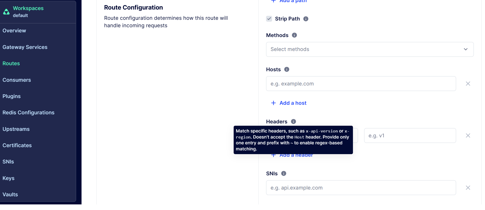

# Route `headers` field with `~` regex prefix does not match requests under `traditional_compatible` router

## Summary

Kong Manager UI's Route Configuration page explicitly instructs users to prefix header values with `~` to enable regex-based matching. However, under the default `traditional_compatible` router, this `~` regex prefix is accepted by the Admin API and stored correctly, but the route **never matches any incoming request**. Exact value matching for the same header works correctly.
This means the **UI is actively guiding users toward a non-functional feature**.

## Environment

- **Kong Image:** `kong/kong-gateway` (latest)
- **Deployment:** Docker Compose (PostgreSQL backend)
- **Router Flavor:** `traditional_compatible` (default, not explicitly configured)
- **Kong Config:** `router_flavor` is commented out in `kong.conf.default`, using the default value
- **Kong Manager URL:** `http://localhost:8002`

Verified via:

```powershell
(Invoke-RestMethod http://localhost:8001/).configuration.router_flavor
# Output: traditional_compatible
```

## Kong Manager UI Tooltip

In the Route Configuration page, the **Headers** field tooltip states:

> "Match specific headers, such as `x-api-version` or `x-region`. Doesn't accept the `Host` header. Provide only one entry and prefix with `~` to enable regex-based matching."



The described behavior does not actually work and users who follow this guidance will create routes that are silently broken.

## Steps to Reproduce

### Via Kong Manager UI

1. Navigate to **Routes** → **New Route** (or edit an existing route)
2. Hover over the **Headers** field info icon — the tooltip instructs to "prefix with `~` to enable regex-based matching"
3. Enter header name `x-api-version` and value `~v[0-9]+` as instructed
4. Save the route — it saves successfully without any warning
5. Send a request with `x-api-version: v1` — returns **404 Not Found** instead of matching

### Via Admin API

#### 1. Create a Service

```bash
curl -X POST http://localhost:8001/default/services \
  -H "Content-Type: application/json" \
  -d '{"name": "test-service", "url": "http://httpbin.org"}'
```

#### 2. Create a Route with exact header matching (WORKS)

```bash
curl -X POST http://localhost:8001/default/routes \
  -H "Content-Type: application/json" \
  -d '{
    "name": "test-header-route",
    "service": {"name": "test-service"},
    "paths": ["/anything-header-test"],
    "headers": {"x-api-version": ["v1", "v2"]}
  }'
```

#### 3. Verify exact match works

```bash
# Returns 200 OK ✅
curl -i http://localhost:8000/anything-header-test -H "x-api-version: v1"

# Returns 200 OK ✅
curl -i http://localhost:8000/anything-header-test -H "x-api-version: v2"

# Returns 404 Not Found ✅ (value not in list)
curl -i http://localhost:8000/anything-header-test -H "x-api-version: v3"

# Returns 404 Not Found ✅ (header not sent)
curl -i http://localhost:8000/anything-header-test
```

#### 4. Update route to regex-based matching (BROKEN)

```bash
curl -X PATCH http://localhost:8001/default/routes/test-header-route \
  -H "Content-Type: application/json" \
  -d '{"headers": {"x-api-version": ["~v[0-9]+"]}}'
```

Admin API returns 200 and stores the value correctly:

```bash
curl -s http://localhost:8001/default/routes/test-header-route
# Response includes: "headers": {"x-api-version": ["~v[0-9]+"]}
```

#### 5. Verify regex match does NOT work

```bash
# Expected: 200 OK, Actual: 404 Not Found ❌
curl -i http://localhost:8000/anything-header-test -H "x-api-version: v1"

# Expected: 200 OK, Actual: 404 Not Found ❌
curl -i http://localhost:8000/anything-header-test -H "x-api-version: v99"
```

Also tested with anchored regex — same result:

```bash
curl -X PATCH http://localhost:8001/default/routes/test-header-route \
  -H "Content-Type: application/json" \
  -d '{"headers": {"x-api-version": ["~^v[0-9]+$"]}}'

# Still 404 for all requests ❌
curl -i http://localhost:8000/anything-header-test -H "x-api-version: v1"
```

## Expected Behavior

The UI tooltip, the [Admin API documentation](https://docs.konghq.com/gateway/latest/admin-api/#route-object), and the actual router behavior should all be consistent. Specifically:

> **headers** — Match specific headers. Provide only one entry and prefix with `~` to enable regex-based matching.

The route should match requests where the `x-api-version` header value matches the regex pattern `v[0-9]+` (e.g., `v1`, `v2`, `v99`).

## Actual Behavior

| Configuration | Admin API | Route Matching | UI Guidance |
|--------------|-----------|----------------|-------------|
| `["v1", "v2"]` (exact) | ✅ Accepted | ✅ Works correctly | N/A |
| `["~v[0-9]+"]` (regex) | ✅ Accepted | ❌ Never matches any request | Tooltip says this should work |
| `["~^v[0-9]+$"]` (regex with anchors) | ✅ Accepted | ❌ Never matches any request | Tooltip says this should work |

The Admin API accepts and stores the regex value without error, but the router does not evaluate it at request time. The route effectively becomes unreachable once a regex header value is configured.

## Impact

- **Misleading UI guidance** — The Kong Manager tooltip actively instructs users to use the `~` prefix for regex matching, directing them toward a feature that does not work under the default router mode
- **Silent failure** — Admin API accepts the regex config without warning, giving a false impression that the route is correctly configured
- **Wasted debugging time** — Users trust the UI tooltip, configure regex headers as instructed, and spend time debugging their regex patterns when the real issue is that the feature is broken
- **Data integrity risk** — Existing working routes can be broken by updating headers to use regex, with no error feedback from either the UI or the API

## Suggested Fix

1. **Fix the router** (preferred) — Make the router correctly evaluate `~`-prefixed regex patterns in header values, as documented and as the UI tooltip describes
2. **Update the UI tooltip**  — Update a correct regex guidance from the tooltip
3. **Add UI validation** (defensive) — Detect the current `router_flavor` via the Admin API (`GET /`) and warn users when they enter a `~`-prefixed header value under a router mode that does not support it

## Cleanup

```bash
curl -X DELETE http://localhost:8001/default/routes/test-header-route
curl -X DELETE http://localhost:8001/default/services/test-service
```
